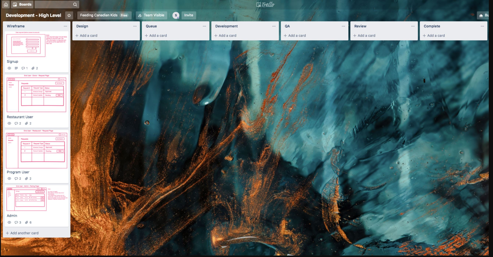
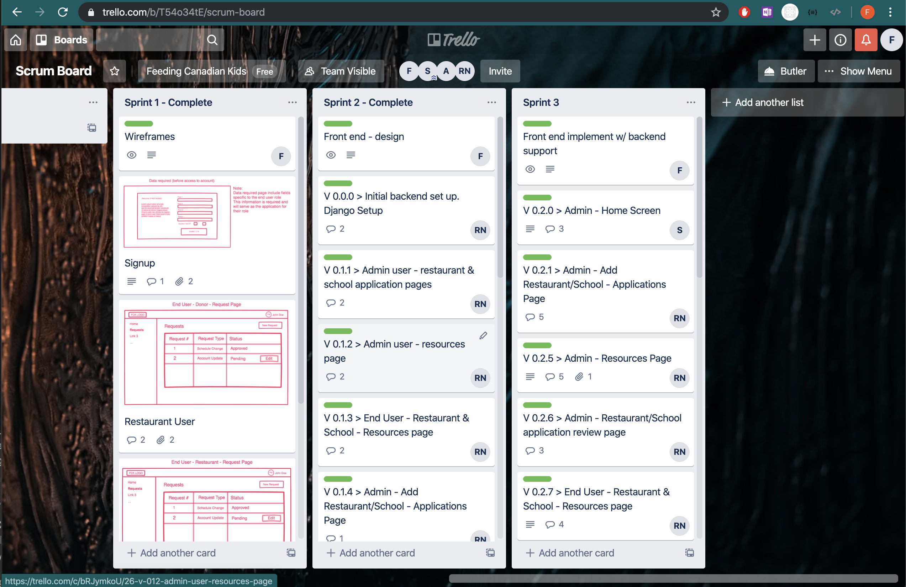
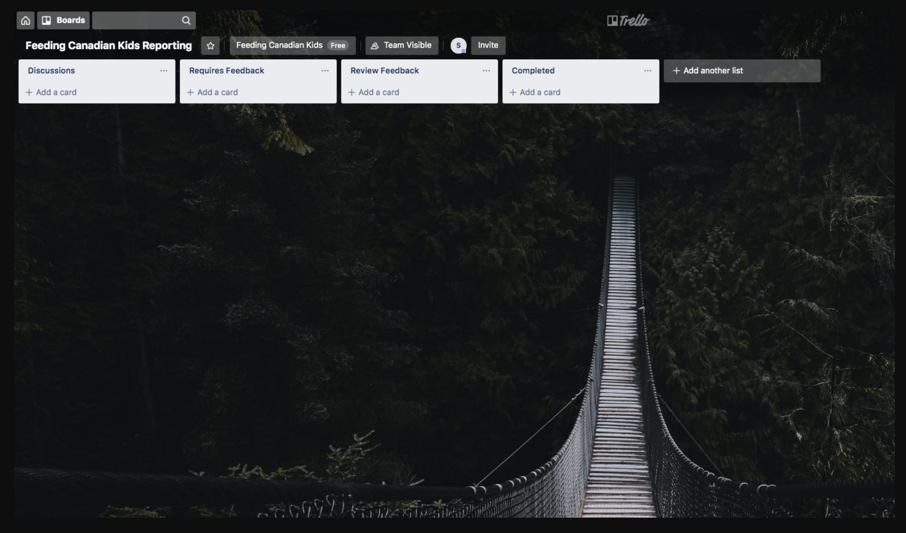
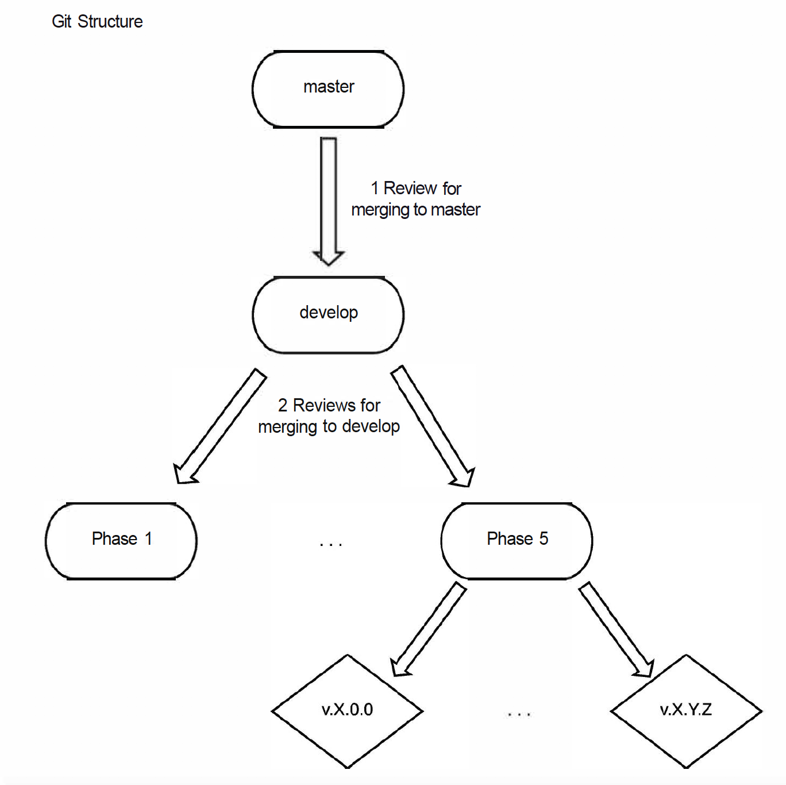

# FCK D2- Part1 Iteration-02.plan

## Iteration 02
- **Start date:** 2019/10/23
- **End date:** 2019/11/11 

## Process

### Roles & responsibilities
    
- **Product manager** : Sebastian Botero
    - Strategize implementation
    - Prioritize features
    - Ensure project is successful
    - Manage scope and timeline
    - Review product features to ensure they meet criteria
    - Responsible for writing both back-end and front-end code for our web app
    - Responsible for Software Testing and Verification
    - Three strengths: Management, React, SQL
    - Three weaknesses: Time commitment, Python, Java
- **Scrum master** : Faraz Khoshbakhtian
    - Responsible for writing both back-end and front-end code for our web app
    - Responsible for Software Testing and Verification
    - Communicates with the product owner to review last sprint and plan for the next sprint
    - Enforce accountability in the team to ensure a strong team dynamic
    - 3 strengths: Python, Java, C
    - 3 Weaknesses: Front-end technologies, Relational Databases, Agile methodology.
- **Developer**: Ramil Nassyrov
    - Facilitates communication with the partners
    - Keeps track of and manages the documents
    - Responsible for writing both back-end and front-end code for our web app
    - Responsible for Software Testing and Verification
    - 3 strengths: Django, React, SQL
    - 3 weaknesses: time commitment, C++, writing

- **Developer**: Taylor Lunt:
    - Responsible for writing both back-end and front-end code for our web app
    - Responsible for Software Testing and Verification
    - 3 strengths: Python, Java, C
    - 3 weaknesses: relational databases, non-relational databases, computer graphics
    
- **Developer**: Runchao Mao:
    - Responsible for writing both back-end and front-end code for our web app
    - Responsible for Software Testing and Verification
    - 3 strengths: Python, Java, C
    - 3 weaknesses: relational databases, non-relational databases, computer graphics
    
- **Developer**: Anindya Biswas:
    - Responsible for writing both back-end and front-end code for our web app
    - Responsible for Software Testing and Verification
    - 3 strengths: Python, Java, C
    - 3 weaknesses: relational databases, non-relational databases, computer graphics

### Team Rules

1. The general direction of the project is informed by the democratic decision of the team members. 
2. Responsibilities are decided upon and assigned during weekly meetings. Progress will be recorded on Trello.

#### Communications
We will communicate with each other through a Slack channel. We are supposed to check for new messages on our Slack channel daily.

We use email as the main mean of communication with the partner. All of our team members will be included in every single email conversation that we have with our partner.

#### Conflict Resolution:
Decisions (or changes) on design require a discussion with at least 50% of our team present.

If there is a conflict between team members, each member will get a chance to speak (without interruption) to voice their opinion, and after a final discussion (5 minutes max), the team will vote on how to move forward.

### Events

Weekly meetings on Tuesday afternoons- Gerstein library at the University of Toronto.

We will use our meetings for code reviews, project planning, and task distribution. In the end, we will help each other solve technical issues and conflicts.

### Partner Meetings

- We have weekly meetings every Wednesday afternoon (In-person). 
    - The purpose of these meetings is to review code and agree on meta team strategies.
- We have bidaily scrum meetings (where we touch base on Slack).
    -  The purpose of these meetings is to go over individually assigned tasks and make sure everyone is on the same page
- We have biweekly meetings every other Wednesday with the partner (In-person).
    - The purpose of these meetings is to discuss design, functionality, and future planning.

### Artifacts

- **Prototype**: We use inVision to create wireframes and designs for this project.
A wireframe mock-up of the application can be found here: [Wireframes](https://projects.invisionapp.com/freehand/document/B0XH0KR3a)
- **Trello Boards**: Trello will be used to facilitate the management of the development process. These boards allow us to monitor feature implementation, bug fixes and assign tasks to the team for accountability.

    - **Development Board**: High-level overview of the development process from wireframes to completion

    - **Scrum Board**: Keeps progress overview of what needs to be done in the current sprint, what's backlogged, and the overall progress as we iterate through sprints. Find the [Scrum Board Here](https://trello.com/b/T54o34tE/scrum-board)

    - **Reporting Board**: Communication that is outside of meetings about discussions on features that require feedback from the client for a decision to be made. 

### Deployment and Github Workflow

The `master` branch is where our final product will be pushed to and deployed from. We have branched off `master` into `develop` where we add our work over different milestones.  

We have broken down our versions where in `V.x.y.z`, `x` represents *major* milestone; `y` represents *minor* milestone (*phase* number); and `z` represents *patch* number. 

Depending on a *major* milestone and *minor* milestone number we are at, we branch off `develop.` Then, each team member works on several patches where, for each patch *z*, they branch off into `V.x.y.z` commit to the branch their patch. After team review (which happens during bi-daily scrums), `V.x.y.z` is then merged with the relevant *phase* branch.

We chose to set up our Git structure in this way to reduce the number of conflicts in our merges, as having six people working out of one folder would not work. Every task that is branched off from a certain phase is for one task, and once that task is finished, it is pushed back into its parent branch. Once that phase is complete, it is then pushed into `develop`, and the next phase is created.

## Product

### What are you planning to build?

We are planning to build a web application that will help Feeding Canadian Kids automate their process of finding restaurant partners and dinner programs that are looking to feed kids and potentially carriers to deliver the food. This application will enable Feeding Canadian Kids' users (Restaurants, after-school programs) to sign up and create profiles to start donating or receiving food. Our product will allow restaurant owners to offer help to the organization and assist dinner program representatives in seeking food donations. We will link our final product with Feeding Canadian Kids' current website https://feedingcanadiankids.org/.

### Who are your target user?

We currently have 3 target users:

* **Program Partners** who want to sign up and make a profile to receive dinner donations. They want the ability to:
    - Create a new Program Profile with an email and password
    - If accepted by a staff admin, have a charity account that they can log into
    - Have the ability to communicate with staff admins to inform them of any changes
    - Submit requests for dates that they need food and how many people they need food for
* **Restaurant Partners** who want to sign up and create a profile to donate food on certain days. They want to:
    - Create a new Restaurant Profile with an email and password
    - If accepted by a staff admin, have a restaurant partner account that they can log into by entering their email and a password
    - Have the ability to communicate with admins to inform them of any changes
    - Submit requests for dates that they can provide food on, and how much food they can provide
* **Feeding Canadian Kids Admins** who want to log in and match restaurants to after school programs.
    - Create a new admin profile with an email and password
    - Go through new applications for both after school programs and restaurants and accept or decline them accordingly
    - For the accepted after school programs, and restaurants the admin wants to go through them and match them together
    - Deal with any changes to applications
    - Have the ability to extract information from the applications for records easily

### Why would your users choose your product? What are they using today to solve their problem/need

  Today Feeding Canadian Kids is using a simple WordPress-based website that they created from a standard template. It has the organization's latest news, contact information, and 'Donate' option that leads you to the Micharity website (https://donate.micharity.com). This website covers their current needs; however, it is not as efficient as they want it to be since they have to manage all the connections and orders by making phone calls. We will develop a web application that will allow them to minimize the number of phone calls they need to make by introducing the restaurant/partner/courier application and partner-restaurant pairing systems. 

  Feeding Canadian Kids is a charitable organization. Many restaurants may be interested in supporting it for the sake of supporting a good cause. Feeding Canadian Kids is currently in the early stages of creating a digital system, and they want us to help them with this task.

  Restaurants and partners of Feeding Canadian Kids will be interested in using our web-application for communication with the organization because we will provide them with an easy-to-use interface that will allow easy communication between them and Feeding Canadian Kids. In particular, it will enable them to create a profile once and then use it anytime to indicate their interest in sharing food with children. Our partner organization, Feeding Canadian Kids, will want to use it because it will provide them with an extensive set of tools that will allow them to add partners and then pair them with restaurants easily.

### How will you build it?

  We are planning to build this web-application using Django and React Frameworks. We want to build the back-end side of our project using Python and leverage JavaScript for the front-end part. We want to use Python and JavaScript because all of us are familiar with Python, and most of us are familiar with JavaScript. Team members who are not familiar with JavaScript agreed to learn it. Regarding the database, our current choice is MySQL because Django has good support for it. We want to use Django because it is fast, secure, simple, and it suits any web-application project. We want to use React because of its component-based approach, simplicity, and testability. We will install Python 3 database connector third-party library in order to be able to use the MySQL database with our project. We will use Django's built-in testing library in order to write and run tests on our back-end code. After that, we will use Snapshot testing in order to test the React components of our front-end code. 
  
  At the next stage of our project, we are planning to deploy our app to some Cloud service. Many cloud services have specific instructions available for how to deploy Django applications. After the deployment process is complete, we will link it with the currently functioning WordPress website and attach it to the same domain name.
 
### What are the user stories that make up the MVP?

1. As a *potential Restaurant Partner*, I want to be able to access a sign-up page, so I can provide a summary and contact information for Feeding Canadian Kids admins to contact me.
    - Acceptance Criteria:
        1. Potential Restaurant Partner can access a sign-up page
        1. Potential Restaurant Partner can supply Feeding Canadian Kids admins with summary and information
        1. Potential Restaurant Partner receives an email when they submit an application

1. As a *potential program partner*,  I want to be able to access a sign-up page, so I can provide a summary and contact information for Feeding Canadian Kids admins to contact me.
    - Acceptance Criteria:
        1. Potential program partner can access a sign-up page
        1. Potential program partner can supply Feeding Canadian Kids admins with summary and information
        1. Potential program partner receives an email when they submit an application

1. As a *Restaurant Partner*, I want to be able to sign-in into my account, so I will be able to see my donation schedule.
    - Acceptance Criteria:
        1. Restaurant Partner can access a sign-in page(authentication with email and password) 
        1. Restaurant Partner can access a personal profile that shows basic statistics of their partnership with Feeding Canadian Kids
        

1. As a *Restaurant Partner*, I want to be able to sign-in into my account, so I will be able to submit requests to Feeding Canadian Kids admins.
    - Acceptance Criteria:
        1. Restaurant Partner can access a sign-in page(authentication with email and password) 
        
        1. Restaurant Partners can submit a form in which they can request from Feeding Canadian Kids admins to:
            1. Amend the donation schedule
            2. Change the information on their account

1. As a *restaurant partner*, I want to have access to a resources page so I can learn who to use Feeding Canadian Kids application.
    - Acceptance Criteria:
        1. Accessing a resources webpage through the restaurant partner profile

1. As a *program partner*, I want to be able to sign-in into my account, so I will be able to see my donation schedule.
    - Acceptance Criteria:
        1. Program Partner can access a sign-in page (authentication with email and password) 
        1. Program Partner can access a personal profile that shows basic statistics of their partnership with Feeding Canadian Kids
        

1. As a *program partner*, I want to be able to sign-in into my account, so I will be able to submit requests to Feeding Canadian Kids admins.
    - Acceptance Criteria:
        1. Program Partner can access a sign-in page (authentication with email and password) 
                
        3. Program Partner can submit a form in which they can request from Feeding Canadian Kids admins to:
            1. Amend the food intake schedule
            2. Change the information on their account

1. As a *program partner*, I want to have access to a resources page so I can learn who to use Feeding Canadian Kids application.
    - Acceptance Criteria:
        1. Accessing a resources webpage through the program partner profile

1. As a *Feeding Canadian Kids admin*, I want to be able to have access to a sign-in page so I can review the operations. 
    - Acceptance Criteria:
        1. Feeding Canadian Kids admins can access a sign-in page (authentication with email and password) 

1. As a *Feeding Canadian Kids admin*, I want to be able to receive applications from potential Restaurant Partners and potential Program Partners so I can sign them up for the program.
    - Acceptance Criteria:
        1. Feeding Canadian Kids admin receives an email notification when someone requests a sign-up
        1. Feeding Canadian Kids admin can add new program partners and restaurant partners to a database easy to use

1. As a *Feeding Canadian Kids admin*, I want to be able to pair restaurant partners with program partners so I can make plans for delivering to kids in need.
    - Acceptance Criteria
        1. Feeding Canadian Kids admin can see a suggested (based on distance, or other factors) list of restaurant partners for each program partner or vice versa

1. As a *Feeding Canadian Kids admin*, it is crucial to me to have access to details of operations so I can manage deliveries and donations smoothly. 
    - Acceptance Criteria:
        1. Feeding Canadian Kids admins have access to contact information of program partners and restaurant partners 
        2. Feeding Canadian Kids admins can see a calendar of upcoming events/deliveries

1. As a *Feeding Canadian Kids admin*, I should be able to add or remove admins so I can manage large operations with a team. 
    - Acceptance Criteria:
        1. Admin can access the account creation page from their profile
        1. Admin can create new admin accounts by supplying a username and password
        1. Admin can edit and delete existing admin accounts

1. As a *Feeding Canadian Kids admin*, I want to have access to a resources page so I can review the functionality of the software system I am managing.
    - Acceptance Criteria:
        1. Accessing a resources webpage through the admin profile

