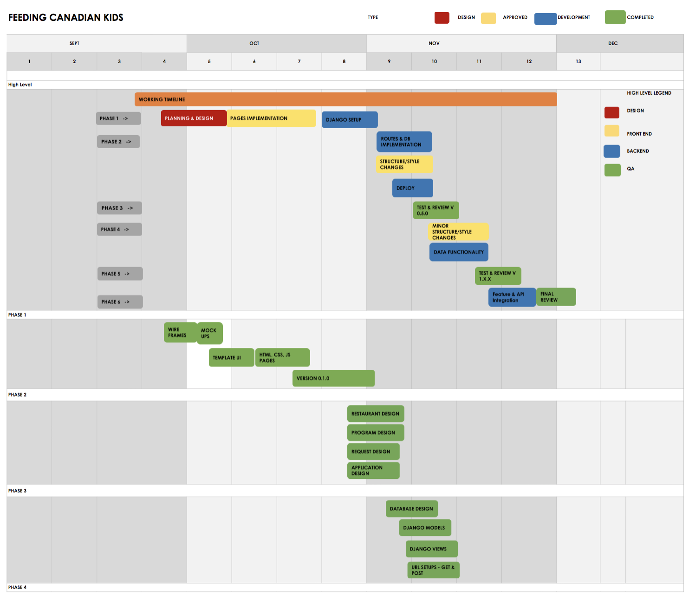
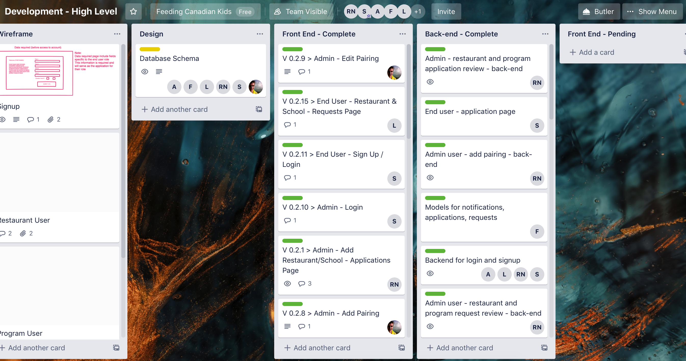
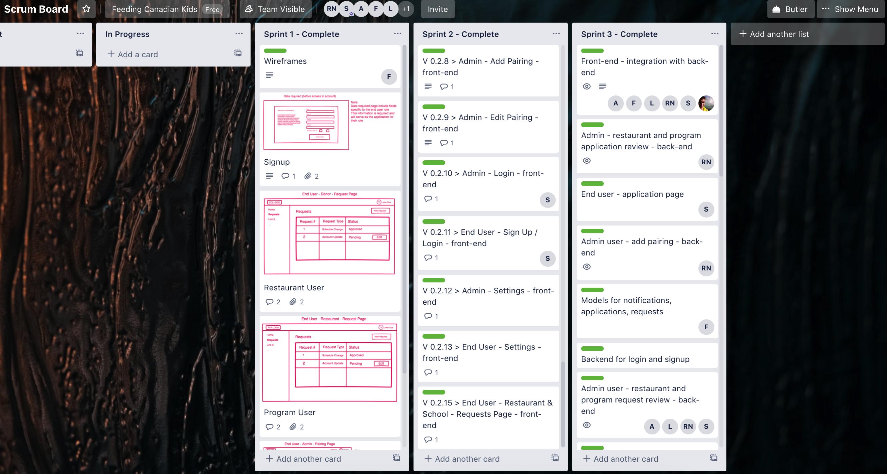
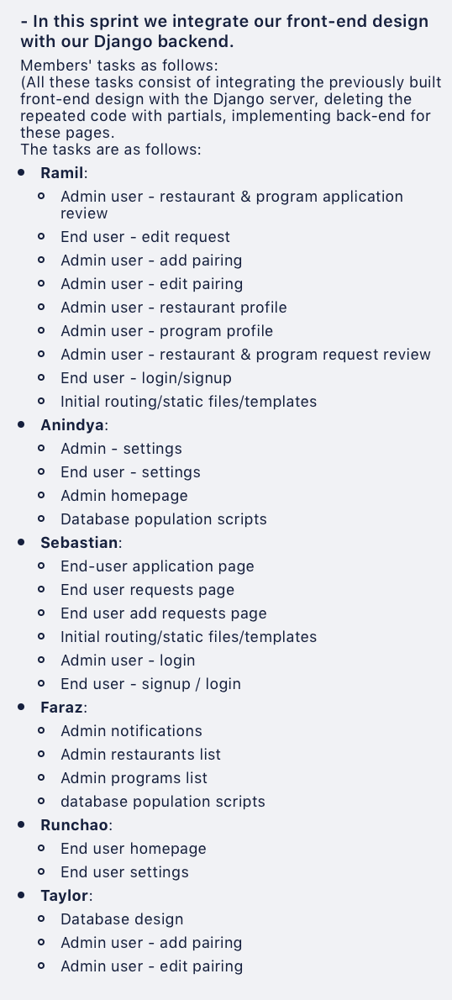
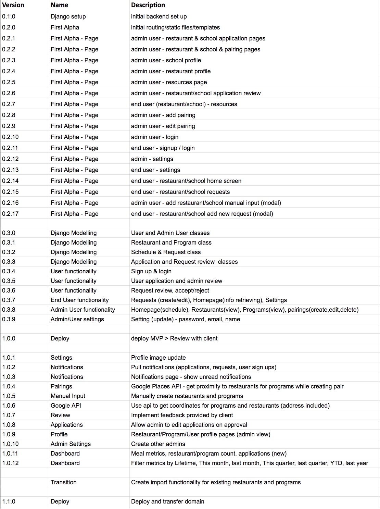

# Feeding Canadian Kids Web application by Team 16

## Iteration 02 - Review & Retrospect

 * When: 27/11/2019
 * Where: Bahen Centre for Information Technology, Room 3175

## Process - Reflection

#### Decisions that turned out well

* One of the best decisions that we've made while working on this project was to create and regularly update a Trello board. It allowed us to manage tasks and their completion successfully. We were also able to describe each task using user stories and acceptance criteria, which helped us to avoid misunderstandings and ambiguity. Moreover, it allowed us to keep track of easily and regularly update our Sprint backlog and product increment. Another right decision on our side was to come up with a product roadmap, which allowed us to split the features between different version numbers and identify the scope of our project.

* One more decision that allowed us to organize our workflow better was to assign roles to the members of our team. A decision was made to have a product manager, scrum master, and four people on the development team. The product manager was responsible for communicating our clients' requests to the development team, as well as making sure that every team member has a clear vision of what needs to be done. It helped us to minimize the number of mistakes that could have been made otherwise. Our scrum master was responsible for regularly checking and updating our product backlog, spring backlog, and product increments. Having this role allowed us to stay organized and keep track of our progress.

* Another right decision on our side was to have regular meetings every day in-person. During those meetings, we updated each other on what we did yesterday, that day, and shared our concerns regarding any potential obstacles that may arise, preventing our team from achieving our current sprint goal. Those meetings helped us to establish strong relationships and understanding between the team members, as well as to highlight potential concerns at their early stages. We also had review meetings every two weeks with our partner, which enabled us to get the relevant feedback on our progress and identify potential areas for improvement. It helped us to make adjustments to the parts of our product that needed improvement, and thus resulted in a higher-quality product.

* Another good decision that we made was to have group coding sessions. These sessions consisted of 3 to 5 of us in a lab working together on tasks. Doing this allowed us to be more productive, as when issues arise or we had questions, there was someone close to ask for help. During the early stages of coding, many did not know about Django, and we were all figuring out how it functioned together. If we did not have these coding sessions together, it would have been very difficult to come up with solutions. 

#### Decisions that did not turn out as well as we hoped

* Our initial decision was to split the front-end from the backend. That is, we first implemented the HTML page templates with the help of CSS and JavaScript. After that, we were planning to integrate those templates with the Django Framework, which we were using for our backend. We were expecting that it would be easy to do that, but as the time shows, we were wrong. Although we were able to keep many parts of the pages unchanged, some other parts required drastic changes to be made, in order to allow Django to insert data into them successfully. All these changes took us a significant amount of time to implement, which delayed the development of our project. At this point, we realized that an ideal decision would be to work on both front-end and backend simultaneously, as it would allow us to smoothly integrate them with each other, and thus save a significant amount of time.

* Our second unfortunate decision was to go with the Django framework, which felt different from other web-development frameworks such as NodeJS, and thus required us to spend a significant amount of time to grasp all of its concepts. 

* Also, we've made the mistake of not reaching out to Adam sooner, who has a lot of experience with Django and thus could have provided a significant amount of technical support for our team.  

* Another poor decision was to create two separate user models that both required authentication, which, as we discovered later on, isn't possible in Django. It pushed us to have to update our user model later on, which required us to make many changes throughout our application. We could've avoided wasting time on this if we were more careful with our design decisions.

#### Planned changes

* We are planning to improve how we communicate with each other since we were sometimes unable to reach some of the team members. We are planning to become more responsive and communicate with each other more often.

* Moving on, we are planning to be more careful with the design decisions that we make to avoid running into serious problems that would require changing a substantial part of our design.

## Product - Review

#### Goals and/or tasks that were met/completed:

+ We had planned to deliver a fully functional product to our client for D2. Even though it took us a bit more time to deliver D2, as of now, our product is fully functional and deployable while the design has gone through careful re-evaluations to make sure the product is suited for future extendibility. 
    + Artifact: The deployable product is the main artifact. Further, we have shared our Trello board on previous iterations. The board, in addition to our GitHub commit-graph, reflects the decisions the group has made in the span of the iteration. 

+ Our client had wanted us to make a platform for the Feeding Canadian Kids where admins and end-users can efficiently coordinate and collaborate. We have been successful in finishing this task. Right now, admins can easily connect with Restaurant owners and Program coordinators. In turn, the end-users can easily access their schedules, reach-out to admins, access resources/documentation, and make requests for profile modification. 
  + Artifact: The deployable product itself is the main artifact. 

+ Another expectation of our client was to make the product such that admins can administer the system easily and without having to go into code. Our product, as of now, allows the admins to do a bulk of their work within our product, where they interact with an intuitive UI and do not have to worry about anything backend related. 
  + Artifact: The deployable product itself is the main artifact

+ We have implemented a live notification system that allows the admins to keep track of new events in their system (e.g., new requests, new applications)

+ For the purpose of proper testing of the product, we have written a script that populates our database with random input and allows the client to test functionality and assure reliability/security. 
    + You can refer to `populate_db.py`. With running this script, the database will be populated by random data.

#### Goals and/or tasks that were planned but not met/completed:

+ We are happy to claim most of our initial planning has been implemented and is functional. However, there is an area that we had to push back for the next iteration. Our client had asked us for an *analytics* page for each of the end-users and admins. In this analytics page, the users are supposed to be able to keep track of their contributions and progress. 
    + We were not able to implement this functionality mostly because of the time restraint. We know how such an application must be implemented, and we are planning to provide it with our final product. 

+ In addition to that, we haven't implemented the backend for pages that allow admin to add restaurants and programs to their portal manually. As a result, we shifted this goal to the third deliverable.

#### How was your product demo?
 * How did you prepare your demo?

    + First of all, we spent a lot of time testing our application to ensure that our product works and looks good and that we can present it to our partners. After that, we came up with a strategy for our walkthrough that we performed to our partners. At this moment, after we presented our product to partners, we understand that the steps we took to prepare for the demo were not done in vain. Our training helped us to feel confident in the conversation with our partners and allowed us to answer all their questions easily.

 * What did you manage to demo to your partner?

     + During the meeting with our partner, we showed them the whole process of using our application. We showed them the user authentication system that includes signup and login pages, homepage, pages for viewing notifications, application process that users go through in order to create restaurant or partner profiles, request process, through which users can send requests different types of requests to admins, the admin portal, that includes features such as application review, request review, creating new pairings as well as managing already existing ones, viewing restaurant and school profiles. Other features of the admin portal that we have managed to present them include homepage that displays recent pairings and pages for viewing lists of programs and restaurants.

 * Did your partner accept the features?
    + Yes, our partner accepted and approved the functionality of our application. In addition to this, they gave us useful tips for improving the user interface and the overall user experience of our application.

 * Were there change requests?
    + Yes, our partner requested that we make some minor changes to the user interface of our application in order to improve the overall user experience. Another request that we received was to add calls to external APs for getting coordinates from the given address to our project. The first change that was requested by our partner was to move the address field to the second position from the top on the application page. The partner also asked to add additional labels and explanations to the program/restaurant application page. 

 * What did you learn from the demo from either a process or product perspective?

    + The demo allowed us to realize the importance of creating a quality user interface in order to improve the overall user experience.

## Meeting Highlights

Going into the next iteration, our main insights are:

+ The main thing we need to be careful about is communication. We need to make sure that team members are all aware of current procedures at any moment during development. To resolve this, we are planning for multiple collective coding sessions for the final deliverable. 
+ The other insight is that we have learned to do things in the “Django” way, instead of how we learn to write the Python code at school. Django makes things easier, but it is important to be familiar with its environment and to do things the way Django expects them to be done. 

### Artifacts:
* Link to deployed application: http://farazkhosh.pythonanywhere.com
* Roadmap:

* Development, high-level:

* Scrum board:

* Product implementation plan:
